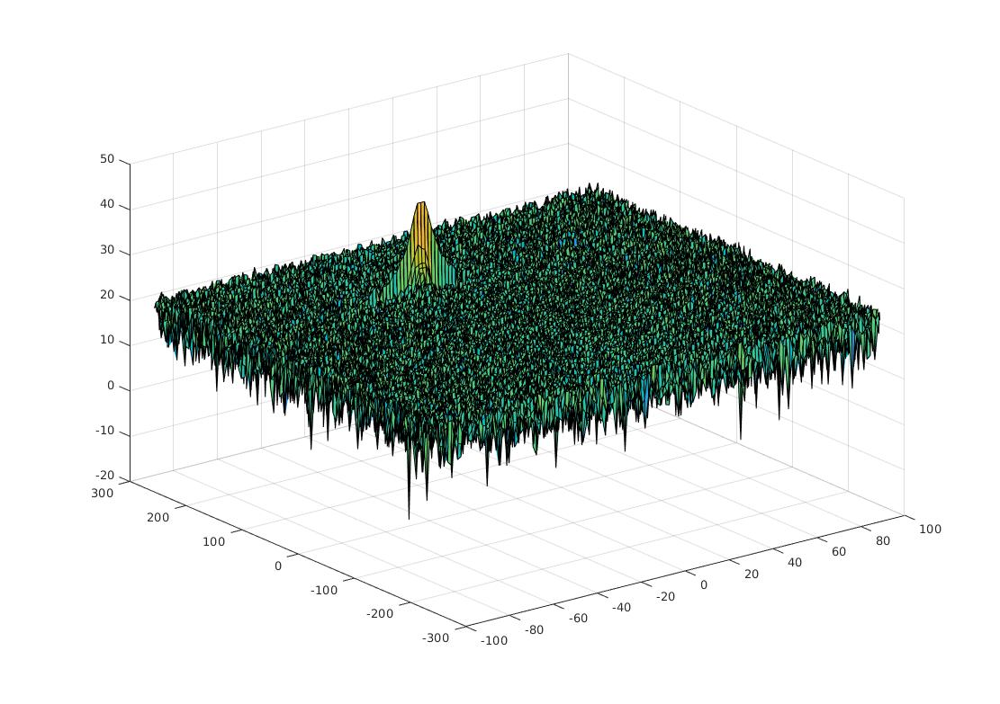
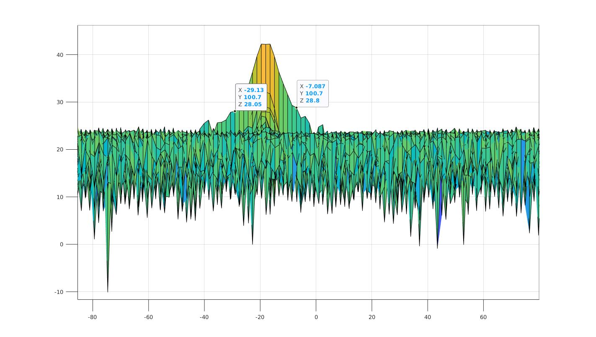
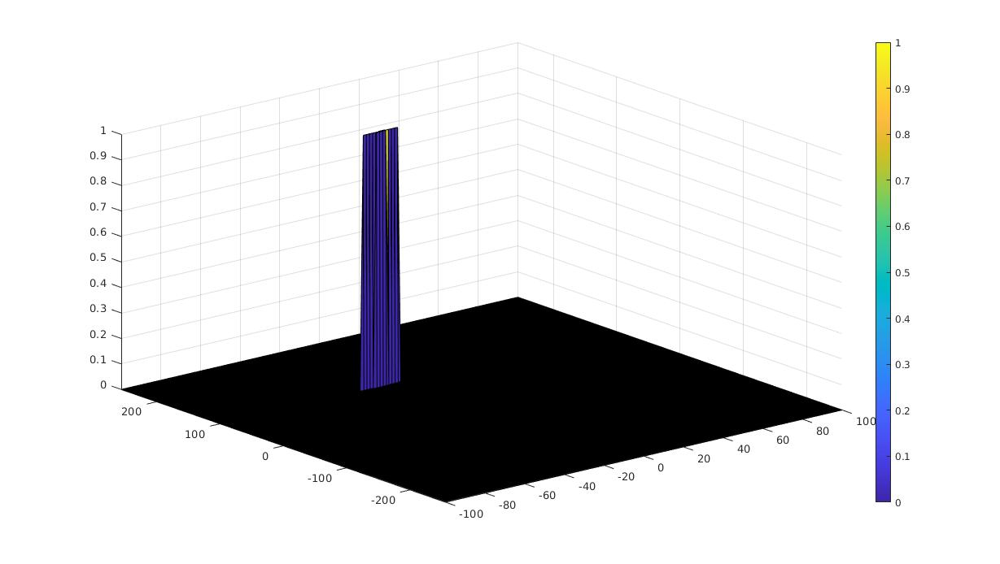

# Udacity SFND Radar Target Generation and Detection

## Implementation steps for the 2D CFAR process

The steps required for implementing 2D CFAR process:
1. ### Determine the number of Training cells for each dimension `Tr` and `Td`.  Similarly, pick the number of guard cells `Gr` and `Gd`.
    ```matlab
    Tr = 10;
    Td = 8;

    Gr = 10;
    Gd = 7;
    ```
2. ### Slide the Cell Under Test (CUT) across the complete cell matrix
    Start sliding the window one cell at a time across the complete FFT 1D array. Total window size should be: 2(T+G)+CUT

    ```matlab
    ...
    for i = Tr + Gr + 1:(Nr/2) - (Gr +Tr)
        for j = Td + Gd +1:Nd - (Gd+Td)
            ...
    ```

3. ### For each step, sum the signal (noise) within all the leading or lagging training cells
    ```matlab
    if ( abs( i - k) > Gr || abs(j - l) > Gd)
        noise_level = noise_level + db2pow(RDM(k,l));
    end
    ```

4. ### Average the sum to determine the noise threshold
    ```matlab
    threshold = pow2db(noise_level/n_traincell);
    ```

5. ### Use an appropriate offset value and scale the threshold
    ```matlab
    threshold = threshold  + offset;
    ```

6. ### Measure the signal in the CUT, which is T+G+1 from the window starting point
    ```matlab
    % Signal of the Cell Under Test (CUT) 
    CUT = RDM(i,j);
    ```

7. ### Compare the signal measured in 5 against the threshold measured in 4


8. ### If the level of signal measured in CUT is smaller than the threshold measured, then assign 0 value to the signal within CUT
    ```matlab
    if  (CUT < threshold)
        RDM(i,j) = 0;
    else
        RDM(i,j) = 1;
    end
    ```

## Selection of Training, Guard cells and offset
Training and Guard cells were selected based on the 2D range doppler response


When you examine the response from the x axis you get the following


Based on the graphs above, the guard cells were chosen based on the  width of the signal in order to avoid leaking our signal into training cells for calculating noise.

Training cells were chosen based on the resolution of our output. In this scenario since we have just one signal to detect, it gives us a lot of room to adjust parameters. If the goal was to detect multiple signals close to each other, more fine tuning on Training Cells is needed.

Offset was selected based on the normal level of noise. This is added so as to boost our detected signal so it can be separated from noise instead of getting mixed up with it.


## Steps taken to suppress the non-thresholded cells at the edges

We simply iterate over those cells and set them to zero.
```matlab
RDM(union(1:(Tr+Gr),end-(Tr+Gr-1):end),:) = 0;  % Rows
RDM(:,union(1:(Td+Gd),end-(Td+Gd-1):end)) = 0;  % Columns
```


### Final output from the CFAR process:
